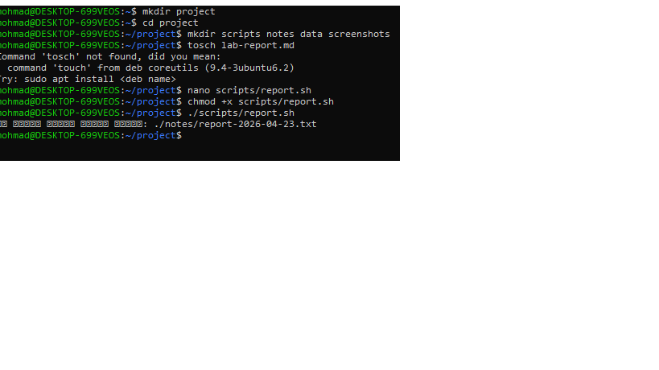
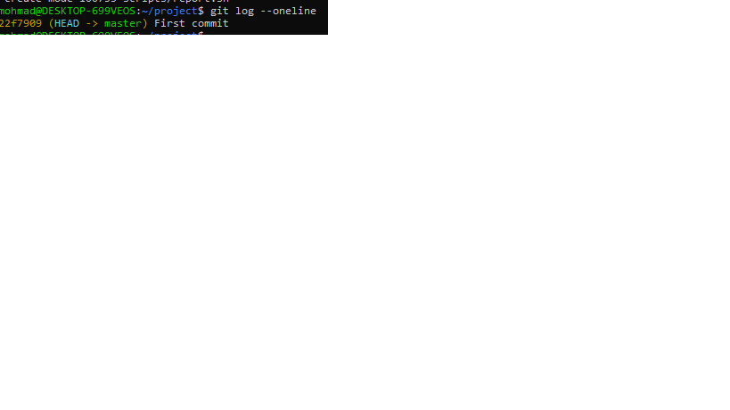

# Lab Report

## أهم الأوامر المستخدمة

- mkdir: لإنشاء مجلد
- cd: للتنقل بين المجلدات
- touch: لإنشاء ملف
- ls: عرض الملفات
- cp: نسخ ملفات
- mv: نقل/إعادة تسمية
- rm: حذف ملفات
- git init: تهيئة مستودع Git
- git add: إضافة ملفات إلى منطقة التتبع
- git commit: حفظ التعديلات
- git log --oneline: عرض سجل مختصر للتعديلات

---

### تنفيذ السكربت

### سجل Git

---

## أسئلة التقييم

### 1. ما الفرق بين < و << و >> ؟

- < : إعادة توجيه الإدخال من ملف.
- << : Here Document لإدخال نص متعدد الأسطر داخل السكربت.
- >> : إضافة المخرجات إلى نهاية ملف (append) بدون الكتابة فوقه.

---

### 2. متى نستخدم source بدل ./script.sh ؟

- source script.sh يشغّل السكربت داخل نفس الـ shell، لذلك أي متغيرات يتم تعريفها تبقى فعّالة.
- ./script.sh يشغّل السكربت في shell جديد، والمتغيرات لا تنتقل للبيئة الحالية.

---

### 3. ما الفرق بين && و || ؟

- && : ينفّذ الأمر الثاني فقط إذا نجح الأول (exit code = 0).
- || : ينفّذ الأمر الثاني فقط إذا فشل الأول (exit code ≠ 0).

---

### 4. متى نستخدم الفروع في Git ؟

- لتجربة ميزات جديدة بدون التأثير على الفرع الرئيسي.
- لتقسيم العمل بين أعضاء الفريق.
- لتجربة إصلاحات أو تغييرات قبل دمجها في المشروع الأساسي.

---

### 5. ما وظيفة ssh-agent ؟

- إدارة مفاتيح SSH في الذاكرة.
- يسمح بالاتصال بخوادم Git بدون إدخال كلمة المرور في كل مرة.
- يحافظ على الأمان ويمنع تخزين كلمات المرور في السكربتات.

---
